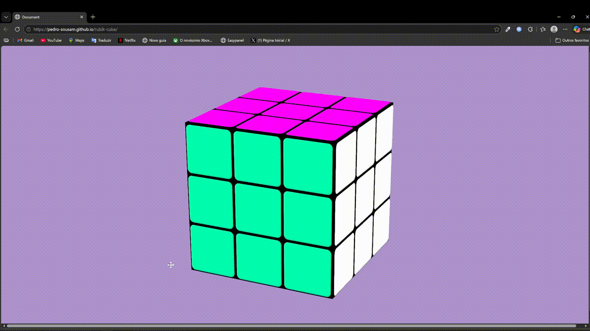

# 🧊 Cubo Mágico 3D - Vanilla JavaScript

Um simulador de Cubo Mágico (Rubik's Cube) totalmente funcional e interativo, construído do zero utilizando apenas tecnologias web nativas. Este projeto demonstra o poder das transformações 3D do CSS e a lógica de programação com JavaScript puro para manipulação de matrizes de movimento.

---

## 🚀 Demonstração

## 🛠️ Tecnologias Utilizadas

O maior desafio e diferencial deste projeto é a ausência de bibliotecas gráficas (como Three.js ou Babylon.js). Tudo foi feito com:

- **HTML5**: Estruturação dos blocos e faces do cubo.
- **CSS3 (Moderno)**: 
    - `transform-style: preserve-3d` 
    - `perspective` 
    - `cubic-bezier` 
    - Variáveis CSS (CSS Variables) para controle dinâmico de rotação.
- **JavaScript (ES6+)**:
    - Lógica de troca de classes para rastrear a posição real das peças.
    - Manipulação de eventos de mouse e teclado.
    - Cálculo de eixos e vetores para garantir que as faces girem corretamente independentemente da orientação do cubo.

---

## 🎮 Funcionalidades e Controles

### Mouse
- **Girar a Câmera**: Clique com botão direito e arraste no fundo para rotacionar o cubo no espaço 3D.
- **Girar Camadas**: Clique em uma das faces e arraste levemente na direção desejada para rotacionar a camada correspondente.

---

## 🧠 Desafios Técnicos Superados

1. **Rastreamento de Eixos**: Quando o cubo gira 180 graus, o que era "esquerda" visualmente pode se tornar "direita" logicamente. O código implementa uma função de `atualizarEixos` para recalcular as direções em tempo real.
2. **Transformações Relativas**: Uso de `DOMMatrix` para capturar estados de transformação atuais e aplicar novas rotações sem resetar a posição anterior.
3. **Animação CSS vs Lógica JS**: Sincronização de tempos de transição CSS com a atualização das classes HTML para permitir movimentos sucessivos sem "quebrar" o cubo.

---

